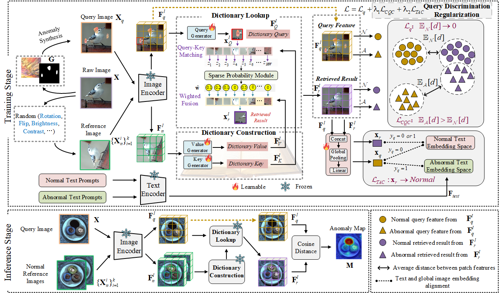

### **DictAS: A Framework for Class-Generalizable Few-Shot Anomaly Segmentation via Dictionary Lookup (ICCV 2025)**



Zhen Qu, Xian Tao, Xinyi Gong, ShiChen Qu, Xiaopei Zhang,
Xingang Wang, Fei Shen, Zhengtao Zhang, Mukesh Prasad, Guiguang Ding

[Paper link](https://www.arxiv.org/abs/2508.13560)

Recent vision-language models (e.g., CLIP) have demonstrated remarkable class-generalizable ability to unseen classes in few-shot anomaly segmentation (FSAS), leveraging supervised prompt learning or fine-tuning on seen classes. However, their cross-category generalization largely depends on prior knowledge of real seen anomaly samples. In this paper, we propose a novel framework, namely DictAS, which enables a unified model to detect visual anomalies in unseen object categories without any retraining on the target data, only employing a few normal reference images as visual prompts. The insight behind DictAS is to transfer dictionary lookup capabilities to the FSAS task for unseen classes via self-supervised learning, instead of merely memorizing the normal and abnormal feature patterns from the training set. Specifically, DictAS mainly consists of three components: (1) **Dictionary Construction** - to simulate the index and content of a real dictionary using features from normal reference images. (2) **Dictionary Lookup** - to retrieve queried region features from the dictionary via a sparse lookup strategy. When a query feature cannot be retrieved, it is classified as an anomaly. (3) **Query Discrimination Regularization**- to enhance anomaly discrimination by making abnormal features harder to retrieve from the dictionary. To achieve this, Contrastive Query Constraint and Text Alignment Constraint are further proposed. Extensive experiments on seven public industrial and medical datasets demonstrate that DictAS consistently outperforms state-of-the-art FSAS methods.
## Table of Contents
* [📖 Introduction](#introduction)
* [🔧 Environments](#environments)
* [📊 Data Preparation](#data-preparation)
* [🚀 Run Experiments](#run-experiments)
* [🔗 Citation](#citation)
* [🙏 Acknowledgements](#acknowledgements)
* [📜 License](#license)

## Introduction
**This repository contains source code for DictAS implemented with PyTorch （Accepted by ICCV 2025）.** 


## Environments
Create a new conda environment and install required packages.
```
conda create -n DictAS python=3.10
conda activate DictAS
conda install pytorch==2.1.1 torchvision==0.16.1 torchaudio==2.1.1 pytorch-cuda=11.8 -c pytorch -c nvidia
pip install -r requirements.txt
```

**Experiments are conducted on a NVIDIA RTX 3090.**


## Data Preparation
 


> **1、Download and prepare the original [MVTec-AD](https://www.mvtec.com/company/research/datasets/mvtec-ad/downloads), [VisA](https://amazon-visual-anomaly.s3.us-west-2.amazonaws.com/VisA_20220922.tar), [MPDD](https://github.com/stepanje/MPDD), and [mvtec3D](https://www.mvtec.com/company/research/datasets/mvtec-3d-ad/downloads) from the official websites to any desired path.**

>**2. Download our curated datasets [BTAD](https://arxiv.org/pdf/2104.10036), [BrasTS](https://arxiv.org/pdf/2107.02314) and [RESC](https://arxiv.org/pdf/2008.03632) from Google Drive: [DATA_Google.zip](https://drive.google.com/file/d/1DDFIquy_rcfcgqIymYIY76kBTXmeLpOj/view?usp=drive_link), and assume that the extracted folder is named DATA_Google. It is worth noting that DATA_Google additionally contains samples from two natural scene datasets (Ade20K and VOC2012), which may serve as optional auxiliary training sets.**

>**3. Download the [DTD](https://www.robots.ox.ac.uk/~vgg/data/dtd/download/dtd-r1.0.1.tar.gz) dataset, similar to the anomaly detection method [DRAEM](https://github.com/VitjanZ/DRAEM?tab=readme-ov-file), for anomaly synthesis.**

**The downloaded dataset format is as follows:**

```
path to mvtec
├── mvtec
    ├── bottle
        ├── train
            ├── good
                ├── 000.png
        ├── test
            ├── good
                ├── 000.png
            ├── anomaly1 (e.g. broken_large)
                ├── 000.png
            ├── anomaly2
            ├── ---
        ├── ground_truth
            ├── anomaly1
                ├── 000.png
```

```
path to visa
├── visa
    ├── candle
        ├── Data
            ├── Images
                ├── Anomaly
                    ├── 000.JPG
                ├── Normal
                    ├── 0000.JPG
            ├── Masks
                ├── Anomaly
                    ├── 000.png
    ├── split_csv
        ├── 1cls.csv
        ├── 1cls.xlsx

```

```
path to MPDD
├── MPDD
    ├── bracket_black
        ├── train
            ├── good
                ├── 000.png
        ├── test
            ├── good
                ├── 000.png
            ├── anomaly1
                ├── 000.png
        ├── ground_truth
            ├── anomaly1
                ├── 000.png
```
```
path to mvtec3D
├── mvtec3D
    ├── bagel
        ├── train
            ├── good
                ├── rgb
                    ├── 000.png
                ├── xyz
                    ├── 000.tif
        ├── test
            ├── good
                ├── rgb
                    ├── 000.png
                ├── gt
                    ├── 000.png
                ├── xyz
                    ├── 000.tif
            ├── anomaly1
                ├── rgb
                    ├── 000.png
                ├── gt
                    ├── 000.png
                ├── xyz
                    ├── 000.tif
        ├── calibration
            ├── camera_parameters.json
        ├── validation
            ├── good
        ├── class_ids.json

```


```
path to DATA_Google
├── DATA_Google
    ├── BrasTS
    ├── RESC
    ├── BTech_Dataset_transformed
    ├── Ade
    ├── VOC
```


```
path to DTD
├── DTD
    ├── images
        ├── banded
        ├── blotchy
        ├── ---
    ├── imdb
    ├── labels

```

> **4、Standardize the above datasets to the same format like MVTec-AD and generate the corresponding .json files. Take MVTec-AD and VisA for example:**

- run **./dataset/make_dataset.py** to generate standardized datasets **./dataset/mvisa/data/visa** and **./dataset/mvisa/data/mvtec**
- run **./dataset/make_meta.py** to generate **./dataset/mvisa/data/meta_visa.json** and **./dataset/mvisa/data/meta_mvtec.json** (This step can be skipped since we have already generated them.)

The format of the standardized datasets is as follows:

```
./datasets/mvisa/data
├── visa
    ├── candle
        ├── train
            ├── good
                ├── visa_0000_000502.bmp
        ├── test
            ├── good
                ├── visa_0011_000934.bmp
            ├── anomaly
                ├── visa_000_001000.bmp
        ├── ground_truth
            ├── anomaly1
                ├── visa_000_001000.png
├── mvtec
    ├── bottle
        ├── train
            ├── good
                ├── mvtec_000000.bmp
        ├── test
            ├── good
                ├── mvtec_good_000272.bmp
            ├── anomaly
                ├── mvtec_broken_large_000209.bmp
        ├── ground_truth
            ├── anomaly
                ├── mvtec_broken_large_000209.png
├── mvtec3D
    ├── bagel
        ├── train
            ├── good
        ├── test
            ├── good
            ├── anomaly
        ├── ground_truth
            ├── anomaly
├── MPDD
    ├── bracket_black
        ├── train
            ├── good
        ├── test
            ├── good
            ├── anomaly
        ├── ground_truth
            ├── anomaly
├── BTAD
├── BrasTS
├── RESC
├── Ade
├── VOC

├── meta_mvtec.json
├── meta_visa.json
├── meta_MPDD.json
├── meta_mvtec3D.json
├── meta_BTAD.json
├── meta_BrasTS.json
├── meta_RESC.json
├── meta_Ade.json
├── meta_VOC.json


./datasets
├── DTD
    ├── images
        ├── banded
        ├── blotchy
        ├── ---
    ├── imdb
    ├── labels
```

**This paper does not introduce any new datasets. If you wish to use the aforementioned datasets, please comply with the usage policies of the original sources. The dataset organization strategy is identical to our previous works [VCP-CLIP](https://github.com/xiaozhen228/VCP-CLIP) and [Bayes-PFL](https://github.com/xiaozhen228/Bayes-PFL), and can therefore be directly applied to our earlier zero-shot anomaly detection projects.**


## Run Experiments
#### Prepare the pre-trained weights
> 1、 Download the CLIP weights pretrained by OpenAI [[ViT-L-14-336](https://openaipublic.azureedge.net/clip/models/3035c92b350959924f9f00213499208652fc7ea050643e8b385c2dac08641f02/ViT-L-14-336px.pt)(default),  [ViT-B-16-224](https://openaipublic.azureedge.net/clip/models/5806e77cd80f8b59890b7e101eabd078d9fb84e6937f9e85e4ecb61988df416f/ViT-B-16.pt), [ViT-L-14-224](https://openaipublic.azureedge.net/clip/models/b8cca3fd41ae0c99ba7e8951adf17d267cdb84cd88be6f7c2e0eca1737a03836/ViT-L-14.pt) to **./pretrained_weight/**

> 2、If you are interested, please download one of the pre-trained weights of our DictAS to **./DictAS_weight/**. "train_visa.pth" indicates that the auxiliary training dataset is VisA, which you can utilize to test any products outside of the VisA dataset [[train_visa.pth]](https://drive.google.com/file/d/1cJGCNJGtqUs1MdGyuZ2diS4yMaOyapDC/view?usp=sharing),  and vice versa [[train_mvtec.pth]](). Note that if you use our pre-trained weights, you must use [[ViT-L-14-336](https://openaipublic.azureedge.net/clip/models/3035c92b350959924f9f00213499208652fc7ea050643e8b385c2dac08641f02/ViT-L-14-336px.pt)] as a default backbone.


#### **1. Training on the seen products of auxiliary datasets**
Note: Simply adjust --dataset to select different auxiliary training datasets.
> bash train.sh

#### **2. Testing and visualizing on the unseen products**
Note: Simply adjust --dataset and --k_shot to select different test datasets and k-normal support samples.
> bash test.sh

#### **3. Single-image testing and visualization**

> python test_single_image.py

#### **4. How to choose k-shot normal support images?**
To ensure a fair comparison, all methods use **the same normal reference images**, and all CLIP-based methods employ the same backbone
(ViT-L-14-336) and input resolution (336×336). In this project, we provide a set of randomly selected normal samples, as shown in **./fix_few_path**. Note that if you wish to test a new dataset with DictAS, you must first standardize the dataset into the MVTec format (as described above), and then add the paths of the selected normal samples in the same format as **./fix_few_path**.

If you wish to automatically and randomly select normal samples and conduct multiple tests to verify the stability of few-shot performance, you can set **self.random_choose** to True in **./dataset.py**. Changing the random seed will then automatically select different normal support samples. However, it is conceivable that a single normal sample cannot represent the entire normal sample space, so fluctuations in the results are to be expected. 

If you find dataset preparation cumbersome and just want to quickly see the few-shot segmentation results, or simply want to play with the code, you can directly use **./test_single_image.py**, which allows testing on a single image given its input path.


#### **5. Can DictAS use other backbones besides CLIP, such as DINOv2 or DINOv3?**

> Yes, DictAS supports all ViT-based backbones. If the model does not include a text encoder, the Text Alignment Constraint can simply be removed during training.


#### **6. Experimental Setting**
Note that we perform auxiliary training on one industrial dataset and directly infer on other industrial and medical datasets. Since the categories in VisA do not overlap with those in the other datasets, we use VisA as the auxiliary training set. To assess VisA itself, we fine-tune our model on the MVTec-AD dataset.

In addition, natural scene datasets such as Ade20K or VOC2012 can also serve as auxiliary training sets to enhance the dictionary lookup capability of DictAS. This only requires changing the **--dataset** parameter in **train.py** to Ade or VOC.

#### **7. Why do we conduct research on class-generalizable few-shot anomaly segmentation?**

In our prior studies on zero-shot anomaly detection, including [VCP-CLIP](https://github.com/xiaozhen228/VCP-CLIP) and [Bayes-PFL](https://github.com/xiaozhen228/Bayes-PFL), we observed that the anomaly perception capability of CLIP models trained via prompt learning remains limited. While they achieve desirable performance on certain texture categories (e.g., wood), their performance drops significantly on other object categories (e.g., cable). This limitation arises because some anomalies are defined solely in relation to normal samples. 

In contrast to previous zero-shot anomaly detection approaches that rely on auxiliary datasets to learn decision boundaries between normal and abnormal samples, DictAS adopts a dictionary lookup strategy rather than modeling category-specific information, thereby enabling the model to remain unaffected by variations across different product categories. The core assumption of DictAS is that normal patch features in a test image can be easily reconstructed from the support image features, whereas anomalous patch features cannot.


#### **8. More deteiled results including few-shot anomaly classification**

Please refer to the Appendix in the paper for more detailed results including few-shot anomaly classification.

## Citation
Please cite the following paper if the code help your project:

```bibtex
@inproceedings{qu2024vcp,
  title={Vcp-clip: A visual context prompting model for zero-shot anomaly segmentation},
  author={Qu, Zhen and Tao, Xian and Prasad, Mukesh and Shen, Fei and Zhang, Zhengtao and Gong, Xinyi and Ding, Guiguang},
  booktitle={European Conference on Computer Vision},
  pages={301--317},
  year={2024},
  organization={Springer}
}

@InProceedings{Qu_2025_CVPR,
    author    = {Qu, Zhen and Tao, Xian and Gong, Xinyi and Qu, ShiChen and Chen, Qiyu and Zhang, Zhengtao and Wang, Xingang and Ding, Guiguang},
    title     = {Bayesian Prompt Flow Learning for Zero-Shot Anomaly Detection},
    booktitle = {Proceedings of the Computer Vision and Pattern Recognition Conference (CVPR)},
    month     = {June},
    year      = {2025},
    pages     = {30398-30408}
}

```

## Acknowledgements
We thank the great works [WinCLIP(zqhang)](https://github.com/zqhang/Accurate-WinCLIP-pytorch),  [WinCLIP(caoyunkang)](https://github.com/caoyunkang/WinClip), [RegAD](https://github.com/MediaBrain-SJTU/RegAD), [VCP-CLIP](https://github.com/xiaozhen228/VCP-CLIP),  [APRIL-GAN](https://github.com/ByChelsea/VAND-APRIL-GAN), [Bayes-PFL](https://github.com/xiaozhen228/Bayes-PFL), [FastRecon](https://github.com/FzJun26th/FastRecon), [AnomalyGPT](https://github.com/CASIA-IVA-Lab/AnomalyGPT), [PromptAD](https://github.com/FuNz-0/PromptAD), [MetaUAS](https://github.com/gaobb/MetaUAS) and [ResAD](https://github.com/xcyao00/ResAD) for assisting with our work.

## Todo list
- [x] Release our DictAS paper
- [x] Release our model weights
- [ ] Release our training code of DictAS
- [ ] Release the training code with alternative backbones, such as ImageBind and DINOv2.
- [ ] ---

## License
The code and dataset in this repository are licensed under the [MIT license](https://mit-license.org/).


